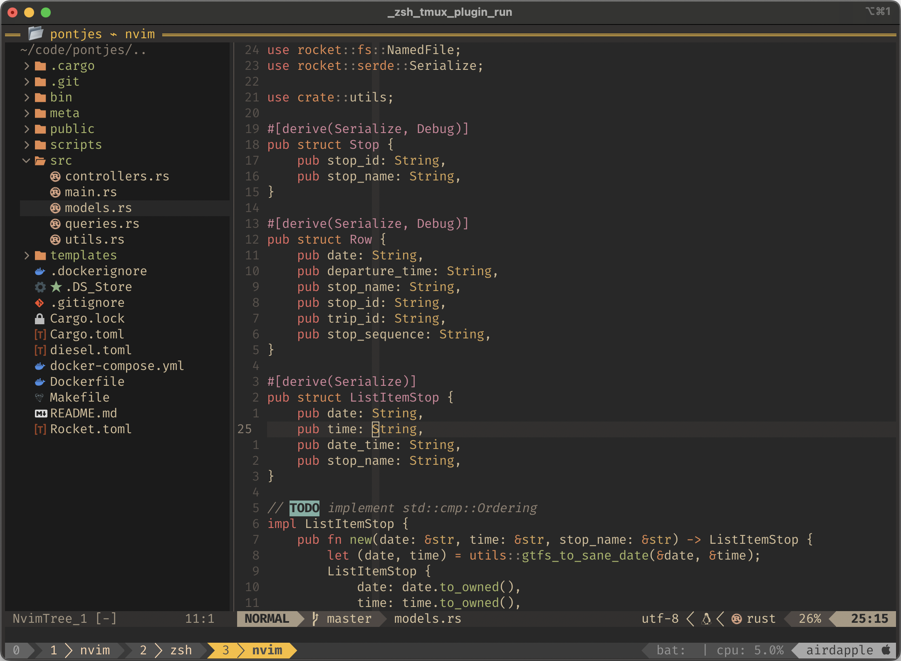

# teh-awesome-vim-setup



### Install for Neovim
```
mkdir ~/src
git clone https://github.com/swapsCAPS/teh-awesome-vim-setup.git ~/src/teh-awesome-vim-setup
mkdir -p ~/.config/nvim
ln -s ~/src/teh-awesome-vim-setup/nvim ~/.config/
nvim
```

### Instaling spell files
```
nvim -u NORC
:set spelllang=...
```

### Settings and hoteys
See (vimopts)[./nvim/lua/setup/vimopts.lua]
See (hotkeys)[./nvim/lua/setup/hotkeys.lua]
